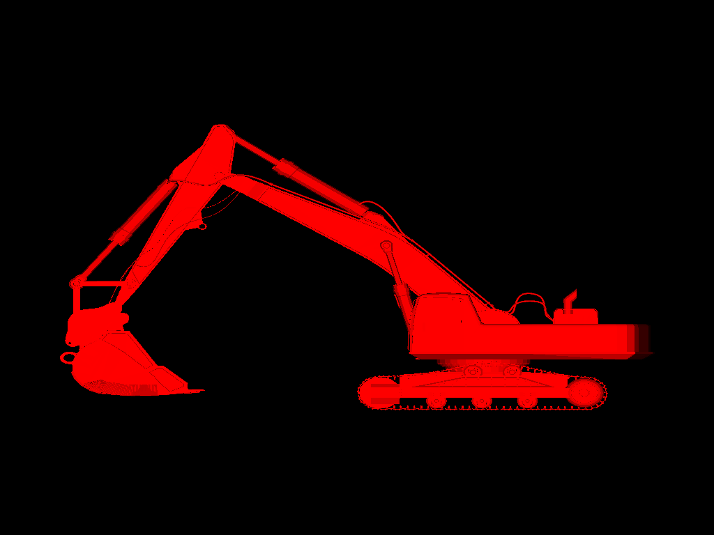
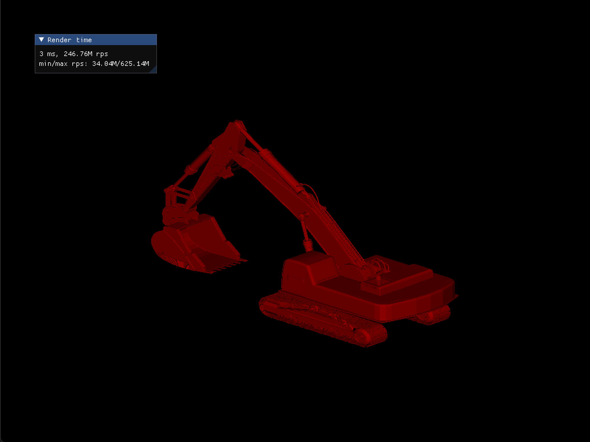
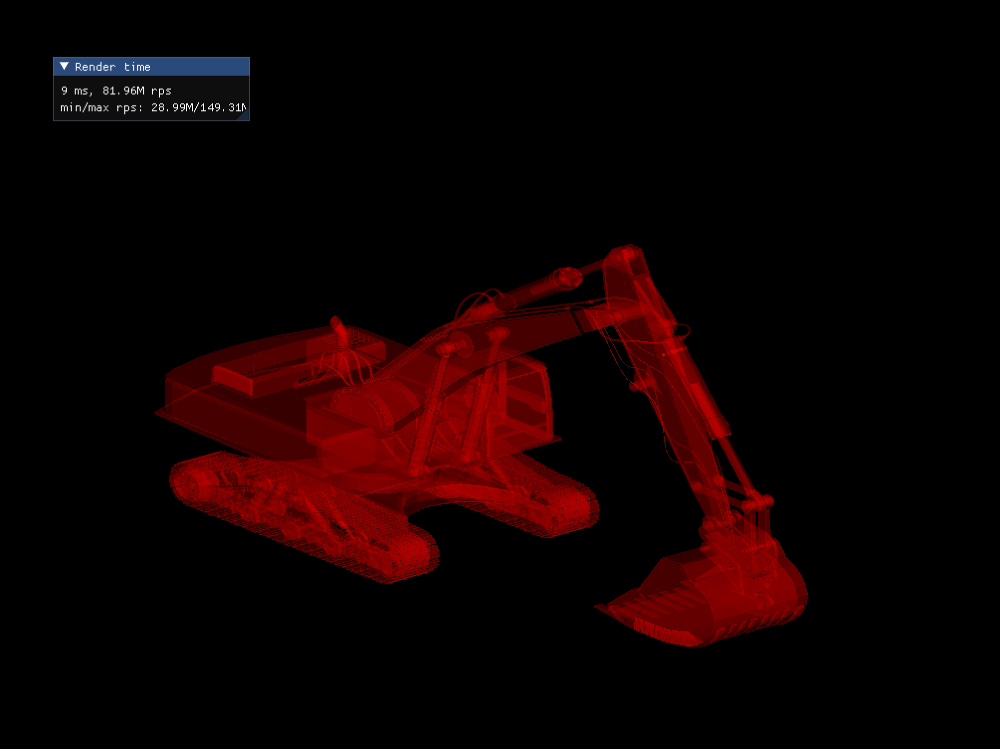
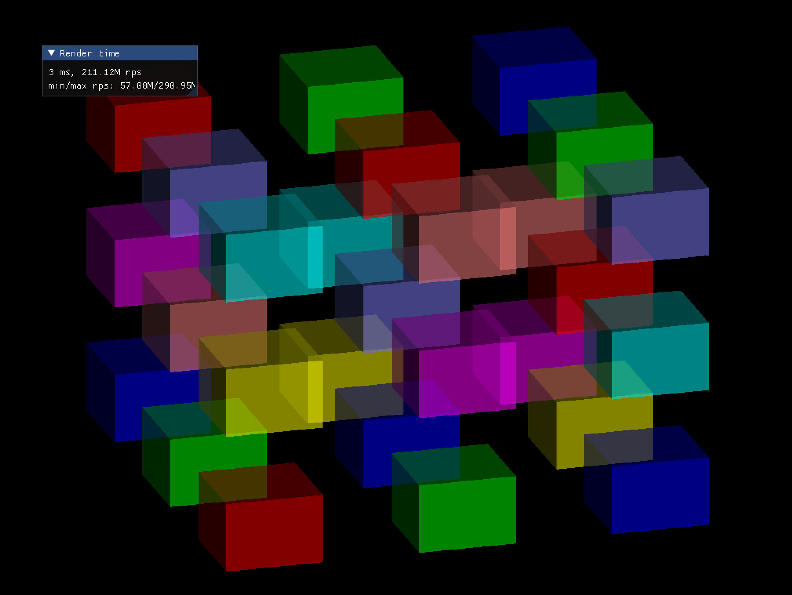

# Intro
This a thesis project.

# Environment
Linux.

More info will be added to README later.

Below is the original README.md from the flatrace project from Wouter.
----------------------------------------------------------------------
# flatrace

Fast CPU flat-shading ray trace experiment.

Who doesn't like real-time RTX GPU based path tracing with global illumination and everything? Everyone does.
But what about plain-old CPU-based raytracing of flat-shaded polygons, and nothing else? No shadows, no 
reflections, just oldskool polygons. Computers are really, really fast, but how fast exactly? Let's find out.

#### Disclaimer
The code in this repository is all really 'get it done' quality code, for experimentation only. Not indicative
of any coding standards I usually try to keep myself to :)

### Baseline performance

It's our old friend Stanford Bunny. Rendering the 1024x768 image above using the most naive, non-optimized 
version of our BVH-based raytracer takes ~200ms on a single core of an M1 MacBook Pro. This translates to ~4 
million rays per second. By no means slow, but not nearly fast enough yet, we can do much better.

First batch of low-hanging fruit ideas:

  * Replace recursive BVH traversal by a stack + loop so it can be fully inlined
  * Render in 4x4 tiles to improve spatial locality, to reduce cache misses
  * Choose a better starting point for BVH traversal, and traverse closest leaf nodes first
  * Tune BVH leaf node size, initial guess is that BVH depth now outweighs reducing the number of triangle intersections
  * Optimize bounding box slab test

After that, things get more complicated, but the following thigs could all yield huge performance gains:

  * Use surface area or other heuristic for BVH building
  * Use SIMD for 4-way (M1, NEON) or even 8-way (x86, AVX2) 'ray packet' intersections
  * Checkerboard rendering with temporal interpolation (thi is cheating of course, but why not)
  * Multithreaded rendering (trivial to implement, but let's save the best for last)

### Optimization round 1

  * Eliminated recursion in BVH traversal: ~40% reduction in bunny render time
  * Enabled -Ofast, which implies -ffast-math (usually evil, but for this use case acceptable): ~10% reduction in bunny render time
  * Render in 16x16 tiles to improve spatial coherence/data locality: ~7% reduction in bunny render time
  * Some minor local optimizations: ~5% reduction in bunny render time
  * Front-to-back ray traversal: no reduction in bunny render time (also no slowdown), but makes the render time for
    other models (especially models that are not 'almost convex' like the bunny) much less sensitive to camera angle

#### Results so far:

  * Bunny render time reduced to ~80ms per frame (~10 million rays per second, ~2.2x speedup relative to baseline)

### Optimization round 2

  * Traverse BVH and intersect triangles in 2x2 ray packets, and use 4-way SIMD for ray-bbox and ray-triange
    intersection logic: ~70% render time reduction

#### Results so far:

  * Bunny render time reduced to ~25ms per frame (~31 million rays per second, ~8x speedup relative to baseline)

#### Notes 

This is currently using 4-way SIMD operations only, since M1 MacBook Pro does not have wider SIMD support. It should
be worthwhile to implement 8-way BVH traversal and triangle intersections for x86 (AVX), the savings there will
not nearly be as much as going from scalar to 4-way SIMD (expect more SIMD lane divergence when tracing larger
ray packets), but this should definitely shave off enough render time to pretty much level the playing field
between x86 (let's say 9th-gen i7) and M1 Pro.

### Optimization round 3

  * Implement 8-way SIMD using AVX intrinsics, intersecting rays in 2x4 pixel blocks at once. 

    Since I'm benchmarking on an Apple M1 Pro CPU, which does not does not have
    AVX, the AVX intrinsics will be compiled to ARM NEON instructions (I'm using
    the excellent [SIMD-everywhere](https://github.com/simd-everywhere) library for
    this). 

ARM NEON only supports 4-lane operations for single-precision floats, but
even despite that, going from 4-way SIMD to 8-way SIMD decreased bunny render
time by yet another ~30%. It appears the M1 Pro has enough FP units and issue
slot width to execute 2x4-way SIMD code at pretty much the speed you would
expect from a native 8-way SIMD instruction set like AVX. Bunny render time has
now gone into interactive framerate territory: ~17 ms per frame (~51 million 
rays per second). Note this is still on a single core!

Things are more interesting on the x86 side, there the 8-way SIMD code improves
render time by almost 50%, by virtue of native AVX2 support. The previous 4-way
SIMD implementation was still significantly trailing the M1 Pro when running on
a Skylake Xeon-W CPU, but using 8-way AVX intrinsics performance across these
two platforms is very close, and hard to attribute to anything in particular
considering we are comparing two different CPU architectures, compilers, and
Operating systems at the same time (x86 GCC Linux vs M1 Clang macOS).

### Optimization round 4

  * Implement surface area heuristic (SAH) for BVH building. Instead of using a simple 
    midway split strategy when subdividing BVH nodes, we now use a surface area
    heurstic. See [Jacco Bikker's BVH article series](https://jacco.ompf2.com/2022/04/13/how-to-build-a-bvh-part-1-basics/)
    for more information.

This change did not improve bunny render time at all, in fact, it slightly decreased 
the number of rays per second traced. The explanation for this is straightforward:
the goal of applying a SAH is to improve balancing of the BVH, such that each BVH
node is subdivided in a way that tries to get the change of any aribtrary ray hitting
either side of the split as close to 50% as possible. This avoids 'clumping' geometry
into certain branches of the BVH, creating large node bounding boxes and high BVH
depth. Now, the bunny model is already pretty close to convex, excluding the ears
it can be approximated pretty closely using just two ellipsoids. This means the 
naive (midpoint split) BVH is already pretty close to ideal, and the SAH will not 
really help anything.

Meet the digger model:

This model is not only much larger at ~130K triangles (vs. ~5K for the bunny), but
also has much more interesing features for benchmarking the BVH performances.

How does the SAH improve rander time for the digger model? Very significantly!
Without using the SAH (using a naive split algorithm instead), render time for 
this model was ~80ms on the M1 Pro (~10 million rays per second). Render time
after optimizing the BVH build using SAH: ~19ms (~40 million rays per second). In
other words: even despite having ~25x the triangle count, render time for the
digger model is only about 1.25x highter than the bunny model. This shows the BVH
is working as intended: while the triangle count is much, much higher for the
digger model, the number of ray-triangle hits ('on' pixels in the output) is 
much lower than the for the bunny model. The BVH is very effective at rejecting
such rays quickly, resulting in only a small performance penalty compared to
the much simpler bunny model.

I will be primarily be using the digger model for benchmarking from now on,
as it is just a lot more interesting for these experiments.

### Optimization round 5 

  * Reduce size of BVH node structure from 64 to 32 bytes, and ensure child
    nodes are adjacent in memory. 
  * Re-order triangles after BVH construction, such that triangles in the 
    same leaf node are adjacent in memory.

These two optimizations improve cache utilization, fitting 2 (x86) or 4 (M1)
nodes per cache line, and increaing the working set that can be kept in cache.
On M1 Pro with it's very large L2 cache, 128-byte cache lines, and very high
RAM bandwidth, the performance difference of this optimization is neglible. On
x86_64, peak ray throughput is improved by up to ~5%, indicating cache
utilization probably wasn't too bad to begin with.  Maybe there is more to be
won here, e.g. by optimizing the BVH node order for cache efficiency.  To be
sure, the percentage L2 cache misses should be profiled before and after this
optimization.

### Optimization round 6 - the big one

All low-hanging fruit has been addressed, so it's time to bring out the big guns:

  * Parallelize rendering. Ray tracing is an embarrasingly parallel workload,
    and hence extremely easy to parallelize. Just replace the main loop over
    all tiles to render by a parallel for. I'm using TBB parallel_for which 
    supports automatic work stealing, so fast (empty) tiles don't introduce
    idle (waiting) threads.

On M1 Pro (8 performance cores + 2 efficiency cores) speedup compared to 
single-threaded rendering, ~7x, which is more than I had hoped for. The peak
ray throughput for the digger model ends up over 600 million rays per second,
at which point you should start wondering whether this task has become
memory-binOBB and throwing additional cores at the problem is not going to
help much. 

Note: the minimum rps (rays per second) figure in the above screenshot is
is pretty much useless and only hit for the first one or two frames: cold 
cache, maybe some OS scheduling effects, etc.

I expect there's probably more performance on the table by optimizing the BVH
layout to further improve cache utilization, but honestly these kinds of ray
throughput numbers sufficiently prove the point: if all you care for is
flat-shaded ray tracing, even for relatively high-detail models a moder CPU can
easily attain interactive framerates. At 600M rays per second peak, and 300M+
rays per second average, a CPU based raytracer like this can fill a 1920x1080
framebuffer at 200-300 frames per second. Not bad at all.

Obviously different models camera angles and fill ratio's will have wildly 
varying performance characteristics. The flatrace demo program renders the 
loaded model on a turntable tracking the min & max ray throughput, and while
there are differences, every model I've thrown at it, even those with over
half a million triangles, easily renders at interactive framerates. On M1 
Pro, the CPU doesn't even break a sweat, hitting frame times under 3ms even
for the most complex models.

### Bonus material

I've also implemented transparent rendering, tracing up to 3 intersections
for each ray, because why not? The implementation is probably far from ideal
as each ray that hits something is re-started, and there is only early rejection
of BVH nodes that are in front of the closest intersection already found. The
ray throughput for transparent rendering is pretty much reduced to 30% of the
throughput for non-transparent rendering. I'm convinced this can be significantly
improved, and a lot of work can be avoid by re-using intersection results so each 
ray only needs to be traced once. But even this naive implementation still
easily yields interactive framerates.

Computers really *are* fast! Good job and thanks a bunch semiconductor engineers! :D
