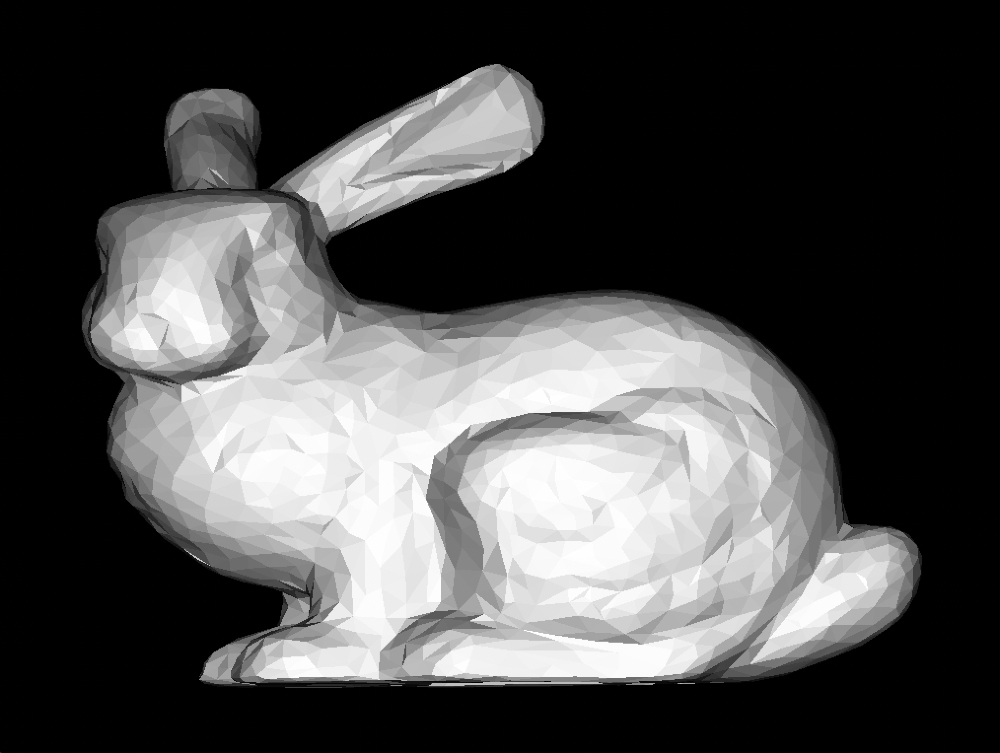

# flatrace

Fast CPU flat-shading ray trace experiment.

Who doesn't like real-time RTX GPU based path tracing with global illumination and everything? Everyone does.
But what about plain-old CPU-based raytracing of flat-shaded polygons, and nothing else? No shadows, no 
reflections, just oldskool polygons. Computers are really, really fast, but how fast exactly? Let's find out.

#### Disclaimer
The code in this repository is all really 'get it done' quality code, for experimentation only. Not indicative
of any coding standards I usually try to keep myself to :)

### Baseline performance

It's our old friend Stanford Bunny. Rendering the 1024x768 image above using the most naive, non-optimized 
version of our BVH-based raytracer takes ~200ms on a single core of an M1 MacBook Pro. This translates to ~4 
million rays per second. By no means slow, but not nearly fast enough yet, we can do much better.

First batch of low-hanging fruit ideas:

  * Replace recursive BVH traversal by a stack + loop so it can be fully inlined
  * Render in 4x4 tiles to improve spatial locality, to reduce cache misses
  * Choose a better starting point for BVH traversal, and traverse closest leaf nodes first
  * Tune BVH leaf node size, initial guess is that BVH depth now outweighs reducing the number of triangle intersections
  * Optimize bounding box slab test

After that, things get more complicated, but the following thigs could all yield huge performance gains:

  * Use surface area or other heuristic for BVH building
  * Use SIMD for 4-way (M1, NEON) or even 8-way (x86, AVX2) 'ray packet' intersections
  * Checkerboard rendering with temporal interpolation (thi is cheating of course, but why not)
  * Multithreaded rendering (trivial to implement, but let's save the best for last)

### Optimization round 1

  * Eliminated recursion in BVH traversal: ~40% reduction in bunny render time
  * Enabled -Ofast, which implies -ffast-math (usually evil, but for this use case acceptable): ~10% reduction in bunny render time
  * Render in 16x16 tiles to improve spatial coherence/data locality: ~7% reduction in bunny render time
  * Some minor local optimizations: ~5% reduction in bunny render time
  * Front-to-back ray traversal: no reduction in bunny render time (also no slowdown), but makes the render time for
    other models (especially models that are not 'almost convex' like the bunny) much less sensitive to camera angle

#### Results so far:

  * Bunny render time reduced to ~80ms per frame (~10 million rays per second, ~2.2x speedup relative to baseline)

### Optimization round 2

  * Traverse BVH and intersect triangles in 2x2 ray packets, and use 4-way SIMD for ray-bbox and ray-triange
    intersection logic: ~70% render time reduction

#### Results so far:

  * Bunny render time reduced to ~25ms per frame (~31 million rays per second, ~8x speedup relative to baseline)

#### Notes 

This is currently using 4-way SIMD operations only, since M1 MacBook Pro does not have wider SIMD support. It should
be worthwhile to implement 8-way BVH traversal and triangle intersections for x86 (AVX), the savings there will
not nearly be as much as going from scalar to 4-way SIMD (expect more SIMD lane divergence when tracing larger
ray packets), but this should definitely shave off enough render time to pretty much level the playing field
between x86 (let's say 9th-gen i7) and M1 Pro.

